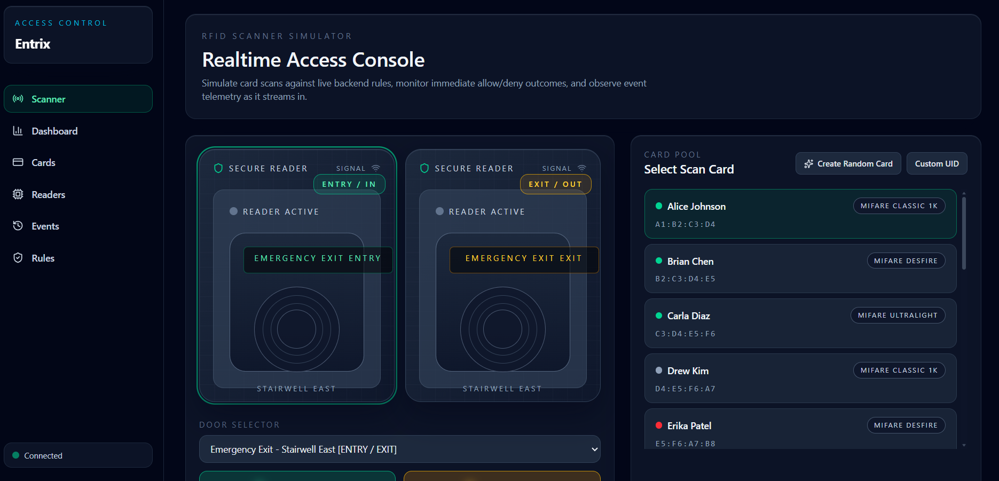
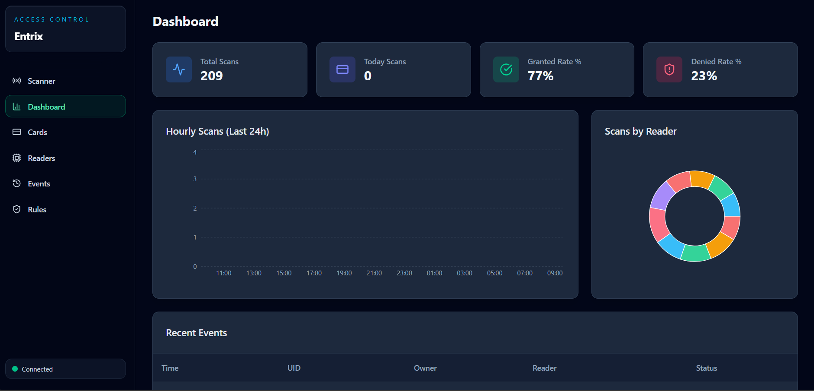
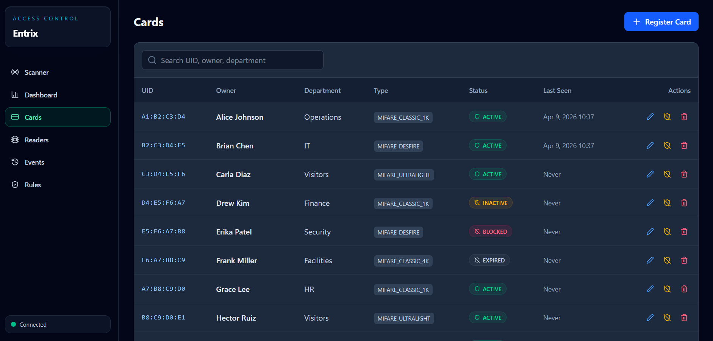
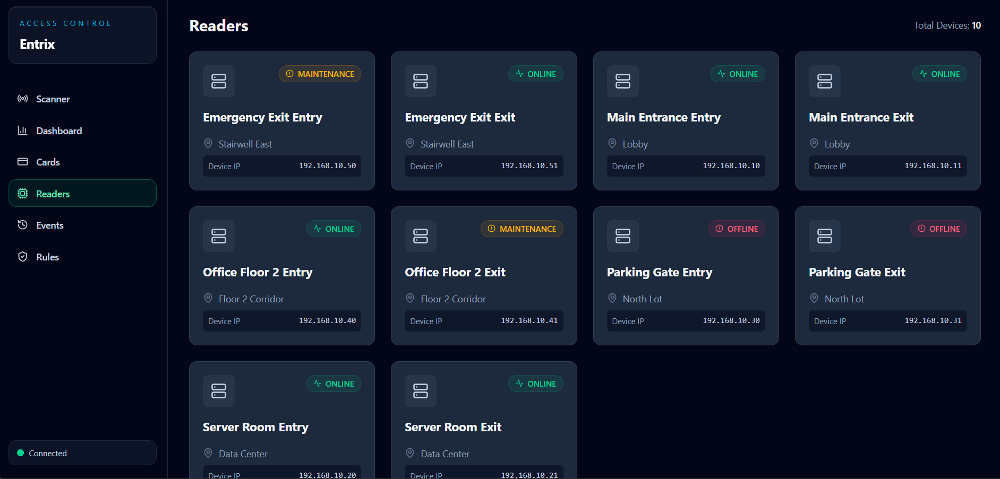
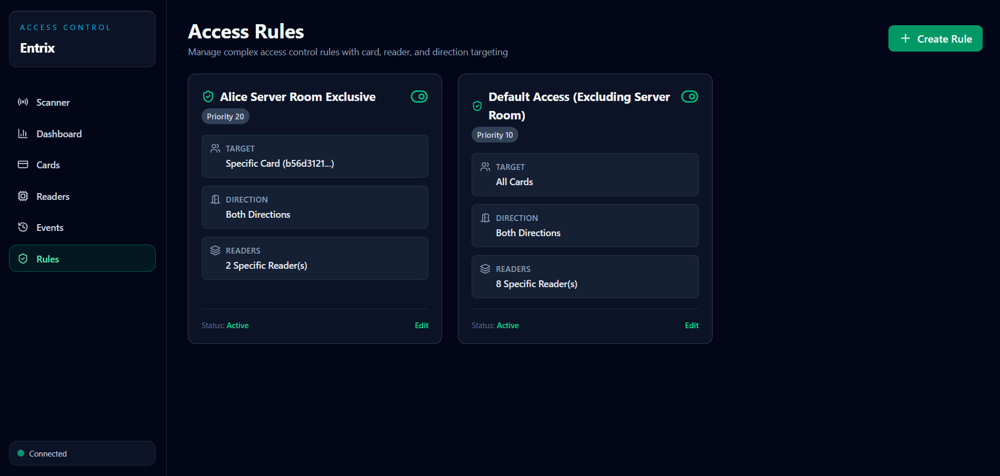

# Entrix RFID Access Control

Entrix is a full-stack RFID access control platform with a simulation console, live scan stream, rule-based authorization, and PostgreSQL persistence.

## Table of Contents

- [What this project includes](#what-this-project-includes)
- [Screenshots](#screenshots)
- [Repository structure](#repository-structure)
- [Prerequisites](#prerequisites)
- [Quick start with Docker](#quick-start-with-docker)
- [Share as Docker Images (no source)](#share-as-docker-images-no-source)
- [Local development without Docker](#local-development-without-docker)
- [Environment variables](#environment-variables)
- [API overview](#api-overview)
- [Realtime events](#realtime-events)
- [Captor (reader) setup guide](#captor-reader-setup-guide)
- [Troubleshooting](#troubleshooting)

## What this project includes

- Backend API using Express + TypeScript.
- PostgreSQL schema creation on startup.
- Frontend dashboard using React + Vite + TypeScript.
- Realtime updates with Socket.IO.
- Simulation endpoint to trigger card scans.
- Seed/reset flows for demo data.

## Screenshots

| Simulator                                       | Dashboard                                       |
| ----------------------------------------------- | ----------------------------------------------- |
|  |  |

| Cards                                           | Readers                                         |
| ----------------------------------------------- | ----------------------------------------------- |
|  |  |



## Prerequisites

- Docker and Docker Compose, or
- Node.js 20+ and PostgreSQL 16+ for local execution.

## Quick start with Docker

1. From the repository root, build and start services:

```bash
docker compose up --build
```

2. Open:

- App: http://localhost
- Backend health: http://localhost:3001/api/health
- Adminer: http://localhost:8080

3. In the app, open **Scanner** and click **Seed DB** to load demo cards, readers, rules, and scan history.

## Share as Docker Images (no source)

Use this project as a private source repo and distribute only Docker images + runtime files.

- Full step-by-step guide: [docs/publish-images.md](docs/publish-images.md)
- Runtime compose: `docker-compose.runtime.yml`
- Runtime env template: `.env.runtime.example`

Quick run from published images:

```powershell
Copy-Item .env.runtime.example .env
# edit .env and set your image names/tags
docker compose --env-file .env -f docker-compose.runtime.yml pull
docker compose --env-file .env -f docker-compose.runtime.yml up -d
```

## Troubleshooting

### Live activity feed stays empty

- Verify frontend can connect to Socket.IO (sidebar status should be Connected).
- Verify backend emits `scan:realtime` on scan simulation.
- Ensure frontend `VITE_SOCKET_URL` points to backend socket origin.

### Scanner says no reader configured for selected door

- Make sure at least one reader exists with that `doorId` and `direction`.
- For full door simulation, create both ENTRY and EXIT readers sharing the same `doorId`.

### API calls fail due to CORS

- Set backend `CORS_ORIGIN` to your frontend origin.

### DB connection errors on startup

- Check `DATABASE_URL` and PostgreSQL credentials.
- Ensure database host/port are reachable.
